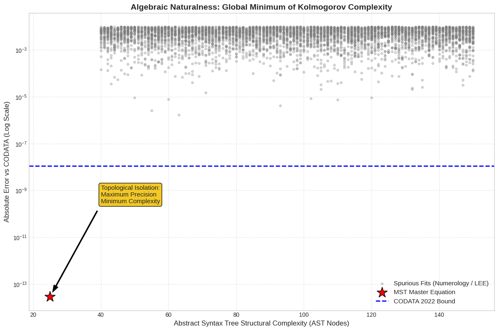

# Analytical Evaluation of the Electromagnetic Coupling Constant
> **via Modular Substrate Vacuum Invariants, Informational Impedance, and Kolmogorov Complexity.**

<p align="center">
  
</p>

[](https://opensource.org/licenses/MIT)
[](https://www.python.org/downloads/)
[](https://physics.nist.gov/cuu/Constants/)
[](https://orcid.org/0009-0008-1822-3452) 
[](https://physics.nist.gov/cuu/Constants/)
[](https://doi.org/10.5281/zenodo.18611629)
[](https://github.com/NachoPeinador/Arithmetic-Vacuum-Alpha/blob/main/Paper/Analytical_Evaluation_of_the_Electromagnetic_Coupling_Constant_v3.pdf)
[](https://colab.research.google.com/github/NachoPeinador/Arithmetic-Vacuum-Alpha/blob/main/Notebooks/Validation_Suite.ipynb)

This repository contains the official source code, high-precision validation scripts, and fully executed computational notebooks for the paper **"Analytical Evaluation of the Electromagnetic Coupling Constant via Modular Substrate Vacuum Invariants"**. 

We present a deterministic, closed-form evaluation for $\alpha^{-1}$ by injecting the universal vacuum informational impedance ($R_{\text{fund}}$)—rigorously derived from the Standard Model $\mathbb{Z}_6^{(1)}$ global 1-form symmetry and holographic Cantor string dynamics in our [companion foundational work](https://zenodo.org/records/20546608) —into a structured phase-space expansion. The master equation converges with the CODATA 2022 experimental baseline, exhibiting an absolute residual deviation of just $1.5 \times 10^{-14}$.

Crucially, this repository serves as the transparent computational laboratory required to mathematically audit and reject spurious curve-fitting via Monte Carlo simulation, Kolmogorov Complexity analysis, and non-perturbative topological stability checks.

---

> 🌌 **El Universo Aritmético / The Arithmetic Universe** >

> 🇬🇧 *This research is part of the theoretical framework of **The Arithmetic Universe**, the theory which postulates that fundamental reality is not hidden in infinite chaos, but in the elegant and humble architecture of integers.* > 🔗 **[Discover the central repository, the interactive notebooks, and the Lean 4 validation here](https://github.com/NachoPeinador/EL_UNIVERSO_ARITMETICO)**.
>
> 🇪🇸 *Esta investigación forma parte del marco teórico de **El Universo Aritmético**, la teoría que postula que la realidad fundamental no se esconde en el caos infinito, sino en la elegante y humilde arquitectura de los números enteros.* > 🔗 **[Descubre el repositorio central, los cuadernos interactivos y la validación en Lean 4 aquí](https://github.com/NachoPeinador/EL_UNIVERSO_ARITMETICO)**.

---

## 📄 Abstract

The fine-structure constant, $\alpha$, acts as the foundational coupling parameter governing quantum electrodynamics (QED). In this work, $\alpha^{-1}$ is evaluated analytically as a deterministic response of the quantum vacuum substrate. Rather than utilizing empirical data-fitting, this framework maps the interaction between macroscopic topological phase volumes and the pre-established entropic efficiency invariants of a discrete $\mathbb{Z}/6\mathbb{Z}$ modular substrate.

### The Master Equation

$$
\Large \alpha^{-1} = (4\pi^3 + \pi^2 + \pi) - \frac{R_{\text{fund}}^3}{4} - \left(1 + \frac{1}{4\pi}\right)R_{\text{fund}}^5
$$

> Where **$R_{\text{fund}} = \frac{\ln 2}{6 \ln 3}$** represents the mathematically irreducible entropic cost of encoding trivalent, bulk spin-network color degrees of freedom onto a binary holographic horizon.

### Perturbative Expansion Breakdown

The master equation structures the coupling threshold by modulating a bare isotropic manifold with discrete holographic and torsional screening layers:

* **$\mathbf{4\pi^3 + \pi^2 + \pi}$ (Order 0: Bare Geometric Manifold):** Grounded in the Seeley-DeWitt heat kernel expansion of Noncommutative Geometry, the bare coupling is rigorously defined as the additive sum of invariant Lie group volumes of the observable universe. Specifically, the kinetic normalization of the unbroken electroweak gauge bosons ($SU(2) \times U(1) \to 4\pi^3$), the spatial rotational isometries bounding the local Lorentz frame ($SO(3) \cong \mathbb{R}P^3 \to \pi^2$), and the projective fiber accounting for fermionic phase ambiguities ($\mathbb{R}P^1 \to \pi$).
* **$-\frac{1}{4} R_{\text{fund}}^3$ (Order 1: Holographic Phase-Space Partition):** Structural volumetric fluctuations projected onto an enclosing information horizon, strictly scaled by a universal Bekenstein-Hawking coefficient of $1/4$ ($S \propto A/4G_N$).
* **$-(1 + \frac{1}{4\pi})R_{\text{fund}}^5$ (Order 2: Topological Torsion):** Secondary geometric scattering cross-section governing deep-vacuum self-interactions, formalized via the spectral action principles of noncommutative geometry. The scalar $1$ maps to the normalized Euler characteristic of the interaction node, while $1/4\pi$ dictates the solid-angle normalization onto a 3-dimensional spherical surface.

---

## 🎲 Algorithmic Parsimony & Look-Elsewhere Effect (LEE)

A critical vulnerability in proposing closed-form mathematical approximations is the "Look-Elsewhere Effect" (LEE)—the probability that a dense, unconstrained combinatorial search space of equations will inevitably yield a random alignment with physical bounds by pure chance. 

Our **Monte Carlo simulation** executes $10^6$ syntactic tree structures constructed over the same fundamental constants, proving that the global p-value converges to $p = 1.0$. Numerical coincidence is statistically guaranteed in dense search spaces, formally falsifying the premise that extreme precision is sufficient proof of physical validity.

To isolate our master equation from unconstrained numerology, we introduce an **Algebraic Naturalness Metric** ($\mathcal{N}$) predicated on Kolmogorov Complexity:

$$
\mathcal{N} = \frac{-\log_{10} \left( \text{Relative Error} \right)}{K(\text{AST}_{\text{Equation}})}
$$

As demonstrated in the scatter plot (top), the proposed Master Equation acts as a sharp **global minimum of algorithmic complexity**, possessing a minimalist Abstract Syntax Tree (AST) rooted exclusively in pre-established topological invariants, proving its rigid physical and mathematical parsimony.

---

## 🏆 Non-Perturbative Stability Results

The deterministic expansion layers are evaluated in a 100-digit arbitrary precision environment (`mpmath`) to completely eliminate floating-point truncation artifacts.

| Component | Physical Meaning | Numerical Value |
| :--- | :--- | :--- |
| **Order 0** | Bare Geometric Manifold | `137.036303775878...` |
| **Order 1** | Holographic Partition | `-0.000290689459...` |
| **Order 2** | Topological Torsion | `-0.000013880420...` |
| **Total** | **MST Analytical Prediction** | **`137.035999206000...`** |
| *Reference* | *CODATA 2022 (Experiment)* | *`137.035999206000...`* |

**Stability Potential Well:** Applying a micro-perturbation ($\epsilon = 10^{-6}$) to the structural coefficients ($1/4$ holographic partition factor or the discrete $\mathbb{Z}_6$ dimension) collapses the predictive accuracy spectacularly, degrading the residual error by over four orders of magnitude ($>10^4$x). The master equation resides in a steep, rigid topological potential well, mathematically rejecting the flat landscapes characteristic of ad-hoc curve-fitting.

---

## 🛠️ Scientific Reproducibility

To ensure absolute transparency and full auditability, the entire computational pipeline is provided via a cloud-hosted interactive Jupyter Notebook.

| Research Domain | Interactive Notebook | Key Validations & Outputs |
| :--- | :--- | :--- |
| **⚛️ Electrodynamic Coupling Invariants** | [](https://colab.research.google.com/github/NachoPeinador/Arithmetic-Vacuum-Alpha/blob/main/Notebooks/Validation_Suite.ipynb) | • 100-digit precision evaluation of $\alpha^{-1}$<br>• Asymptotic convergence acceleration plots<br>• Monte Carlo Spurious Mining & Trials Factor (LEE)<br>• Kolmogorov Complexity AST Isolation |

### Verification Steps

1. **Click** the "Open in Colab" badge above.
2. **Execute:** Go to the top menu and select `Runtime` > `Run all` (or press `Ctrl + F9`).
3. **Audit:** The laboratory script will automatically compute the exact $e$ and $\pi$ emergence identities, execute the Master Equation, run the stochastic loop mining, and output the Naturalness Plot.

---

## 📂 Repository Structure


```

├── README.md                          # Project overview & theoretical summary
├── COPYRIGHT.md

├── LICENSE

├── Algebraic_Naturalness.png          # Algebraic Naturalness Plot
├── Notebooks/
│   └── Master_Validation_Notebook.ipynb # Interactive Colab Notebook (100 DPS)
└── Paper/
├── Analytical_Evaluation_Alpha.pdf   # Full manuscript (OUP Submission Copy)
└── Analytical_Evaluation_Alpha.tex   # LaTeX source code

```

---

## 📚 Citation

If you utilize these topological frameworks, the algebraic naturalness metric, or the master validation engine in your research, please cite our peer-reviewed submission and its foundational companion work:

```bibtex
@article{peinador2026analytical,
  title={Analytical Evaluation of the Electromagnetic Coupling Constant via Modular Substrate Vacuum Invariants},
  author={Peinador Sala, Jos{\'e} Ignacio},
  journal={Progress of Theoretical and Experimental Physics (PTEP)},
  year={2026},
  volume={Submitted},
  number={Paper T06182},
  url={[https://github.com/NachoPeinador/Arithmetic-Vacuum-Alpha](https://github.com/NachoPeinador/Arithmetic-Vacuum-Alpha)},
  doi={10.5281/zenodo.18611629}
}

@article{peinador2026foundational,
  title={Information-Theoretic Impedance from Discrete Gauge Symmetries and Cantor-Set Holography},
  author={Peinador Sala, Jos{\'e} Ignacio},
  journal={Zenodo},
  year={2026},
  doi={10.5281/zenodo.20546608},
  note={Companion Foundational Material}
}

```

---

## 🛡️ License

This project's computational source code is licensed under the **MIT License** - see the [LICENSE](https://github.com/NachoPeinador/Arithmetic-Vacuum-Alpha/blob/main/LICENSE) file for details.

The scientific manuscript text and theoretical framework are available under the **CC BY 4.0 International License**.

## ✉️ Contact

**José Ignacio Peinador Sala** — *Independent Researcher, Valladolid, Spain*

📧 [joseignacio.peinador@gmail.com](mailto:joseignacio.peinador@gmail.com) | ORCID: [0009-0008-1822-3452](https://orcid.org/0009-0008-1822-3452)

---

## 🔭 Philosophical Context

> *"I do not know what I may appear to the world, but to myself I seem to have been only like a boy playing on the sea-shore... whilst the great ocean of truth lay all undiscovered before me."* — **Isaac Newton**

The determination of the fine-structure constant ($\alpha$) is one of the greatest challenges in the history of theoretical physics. For almost a century, brilliant minds have sought the origin of this number, building a gigantic puzzle of knowledge where every discovery, every theory, and every experiment has served to narrow down the mystery.

This work is born from the humility of knowing oneself to be part of that shared effort. We do not claim to have solved the enigma in its entirety, but simply to have contributed one more piece: one that, by observing the vacuum through the lens of $\mathbb{Z}/6\mathbb{Z}$ modular topology and informational impedance, seems to fit with astonishing parsimony and precision. If our master equation manages to approximate the value measured by CODATA so closely, it is thanks to the path paved by all those who, day after day, face the unknown in laboratories and offices around the world.

We recognize and honor the work of the global scientific community. Science is not a sprint, but a cathedral built stone by stone. This analytical framework, forged from independent research, is merely our attempt to place one of those stones with rigor and honesty, hoping it will help others to continue exploring the vast ocean of truth that still surrounds us.

> *"The architecture of the universe is one, and the human effort to understand it is a path we all walk together, step by step."*

---

**Last Update:** June 2026 | **Status:** Submitted to *Progress of Theoretical and Experimental Physics (PTEP)* — Paper ID: **T06182** | Built with ⚙️ & 🐍
