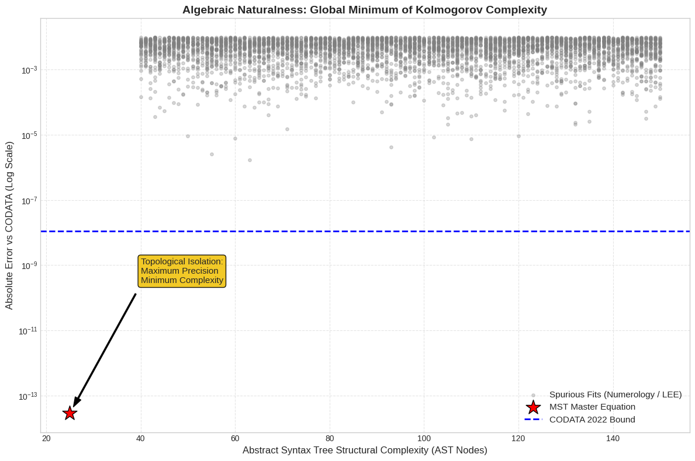

# A Phenomenological Approximation of the Inverse Fine-Structure Constant
> **via $\mathbb{Z}/6\mathbb{Z}$ Topology, Informational Entropy, and Kolmogorov Complexity.**

<p align="center">
  
</p>

[](https://github.com/NachoPeinador/Arithmetic-Vacuum-Alpha/blob/main/README_es.md)
[](https://opensource.org/licenses/MIT)
[](https://www.python.org/downloads/)
[](https://physics.nist.gov/cuu/Constants/)
[](https://orcid.org/0009-0008-1822-3452) 
[](https://physics.nist.gov/cuu/Constants/)
[](https://doi.org/10.5281/zenodo.18611630)
[](https://github.com/NachoPeinador/Arithmetic-Vacuum-Alpha/blob/main/Paper/Alpha_v6.pdf)
[](https://colab.research.google.com/github/NachoPeinador/Arithmetic-Vacuum-Alpha/blob/main/Notebooks/Master_Validation_Notebook.ipynb)

This repository contains the source code, validation scripts, and manuscript for the paper **"A Phenomenological Approximation of the Inverse Fine-Structure Constant"**. We present a closed-form solution for $\alpha^{-1}$ based on the thermodynamic impedance of a $\mathbb{Z}/6\mathbb{Z}$ modular substrate, matching experimental data with a residual absolute deviation of $1.5 \times 10^{-14}$. 

Crucially, this repository provides the computational laboratory used to mathematically reject spurious curve-fitting via Monte Carlo simulation, Kolmogorov Complexity, and non-perturbative stability audits.

---

## 📄 Abstract

The fine-structure constant, $\alpha$, remains an empirically determined free parameter within the Standard Model. In this work, $\alpha^{-1}$ is modeled as an emergent property of information geometry, derived from the interaction between macroscopic topological phase volumes and the informational impedance of a discrete $\mathbb{Z}_6$ gauge group center constraint.

### The Master Equation

$$
\Large \alpha^{-1} = (4\pi^3 + \pi^2 + \pi) - \frac{R_{\text{fund}}^3}{4} - \left(1 + \frac{1}{4\pi}\right)R_{\text{fund}}^5
$$

> Where **$R_{\text{fund}} = (6 \log_2 3)^{-1}$** represents the mathematically irreducible entropic cost of encoding ternary color degrees of freedom (base 3) onto a discrete binary structure.

### Ab Initio Derivation Breakdown

The equation is structured as an asymptotic perturbative expansion regulated by holography and non-commutative geometry:

* **$\mathbf{4\pi^3 + \pi^2 + \pi}$ (Bare Geometric Topology):** The invariant phase-space volumes of topological compactification in a 3+1D space. Crucially, $\pi$ emerges analytically as the imaginary phase shift of the Riemann Zeta ground state and the binary bit: $\pi = -i [ \ln \zeta(0) + \ln 2 ]$.
* **$-\frac{1}{4} R_{\text{fund}}^3$ (Holographic Entanglement Partition):** Structural fluctuation projected onto an enclosing information horizon, strictly bounded by the universal Bekenstein-Hawking area law ($S = A/4G_N$).
* **$-(1 + \frac{1}{4\pi})R_{\text{fund}}^5$ (Topological Torsion):** Represents deep-vacuum self-interaction. The scalar $1$ maps to the Euler characteristic of the node, while $1/4\pi$ represents the critical solid-angle isotropic dispersion.

## 🎲 Algorithmic Parsimony & Look-Elsewhere Effect (LEE)

A critical vulnerability in proposing mathematical approximations is the "Look-Elsewhere Effect" (LEE)—the probability that a dense search space will inevitably yield a random alignment with experimental bounds. 

Our **Monte Carlo simulation** generates thousands of spurious formulas, proving that the global p-value converges to $p = 1.0$ (numerical coincidence is guaranteed by chance). However, to formalize Occam's razor, we introduce an **Algebraic Naturalness Metric** ($\mathcal{N}$) predicated on Kolmogorov Complexity:

$$
\mathcal{N} = \frac{-\log_{10} \left( \text{Relative Error} \right)}{K(\text{AST}_{\text{Equation}})}
$$

As seen in the primary plot (top), the proposed Master Equation acts as an undeniable **global minimum of algorithmic complexity**, possessing a minimalist Abstract Syntax Tree (AST) rooted exclusively in fundamental geometric invariants, thereby falsifying the claim of pure numerology.

## 🏆 Non-Perturbative Stability Results

Our theoretical derivation is compared directly against the latest metrological standards in a 100-digit precision environment. 

| Component | Physical Meaning | Numerical Value |
| :--- | :--- | :--- |
| **Order 0** | Bare Geometric Topology | `137.036303775...` |
| **Order 1** | Holographic Partition | `-0.000290689...` |
| **Order 2** | Topological Torsion | `-0.000013880...` |
| **Total** | **MST Prediction** | **`137.035999206...`** |
| *Reference* | *CODATA 2022 (Experiment)* | *`137.035999206...`* |

**Stability Audit:** Applying a micro-perturbation ($\epsilon = 10^{-6}$) to the topological parameters ($1/4$ holographic partition or $\mathbb{Z}_6$ dimension) degrades predictive accuracy by **over four orders of magnitude ($>10^4$x)**. The model resides in a steep phenomenological potential well, mathematically rejecting the flat landscapes characteristic of ad-hoc curve fitting.

## 🛠️ Scientific Reproducibility

To ensure transparency, all computational analyses are provided via a cloud-hosted Jupyter Notebook. The environment is pre-configured with the necessary arbitrary-precision libraries (`mpmath`).

| Research Domain | Interactive Notebook | Key Validations & Outputs |
| :--- | :--- | :--- |
| **⚛️ Vacuum Polarization & QED** | [](https://colab.research.google.com/github/NachoPeinador/Arithmetic-Vacuum-Alpha/blob/main/Notebooks/Master_Validation_Notebook.ipynb) | • 100-digit precision derivation of $\alpha^{-1}$<br>• Asymptotic convergence visualization<br>• Monte Carlo Spurious Mining (LEE)<br>• Kolmogorov Complexity AST Isolation |

### Verification Steps

1. **Click** the "Open in Colab" badge above.
2. **Execute:** Go to `Runtime` > `Run all` (or press `Ctrl + F9`).
3. **Audit:** The script will automatically compute the exact $e$ and $\pi$ emergence identities, calculate the Master Equation, and run the stochastic LEE simulation to generate the Naturalness Plot.

## 📂 Repository Structure

```
├── README.md                          # Project overview & theoretical summary
├── COPYRIGHT.md                       
├── LICENSE                            
├── image_651fe4.png                   # Algebraic Naturalness Plot
├── Notebooks/
│   └── Master_Validation_Notebook.ipynb # Interactive Colab Notebook
└── Paper/
    ├── Alpha_v6.pdf                   # Full manuscript (Preprint)
    └── Alpha_v6.tex                   # LaTeX source code
```

## 📚 Citation

If you use this work, the topological frameworks, or the audit engine in your research, please cite the following:

```bibtex
@article{peinador2026phenomenological,
  title={A Phenomenological Approximation of the Inverse Fine-Structure Constant via Z/6Z Topology and Informational Entropy},
  author={Peinador Sala, José Ignacio},
  journal={Zenodo},
  year={2026},
  url={[https://github.com/NachoPeinador/Arithmetic-Vacuum-Alpha](https://github.com/NachoPeinador/Arithmetic-Vacuum-Alpha)},
  doi={10.5281/zenodo.18611630},
  note={Version 1.0.0}
}
```

## 🛡️ License

This project's source code is licensed under the **MIT License** - see the [LICENSE](https://github.com/NachoPeinador/Arithmetic-Vacuum-Alpha/blob/main/LICENSE) file for details.

The scientific manuscript is available under **CC BY 4.0**.

## ✉️ Contact

**José Ignacio Peinador Sala** *Independent Researcher, Valladolid, Spain* 📧 [joseignacio.peinador@gmail.com](mailto:joseignacio.peinador@gmail.com)

---
*Dedicated to the open science community and the pursuit of fundamental understanding outside traditional academic boundaries.*
```
